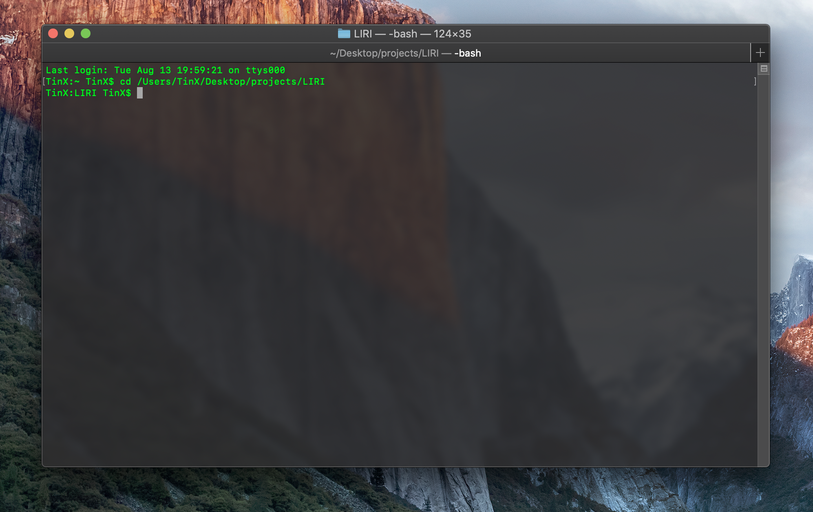
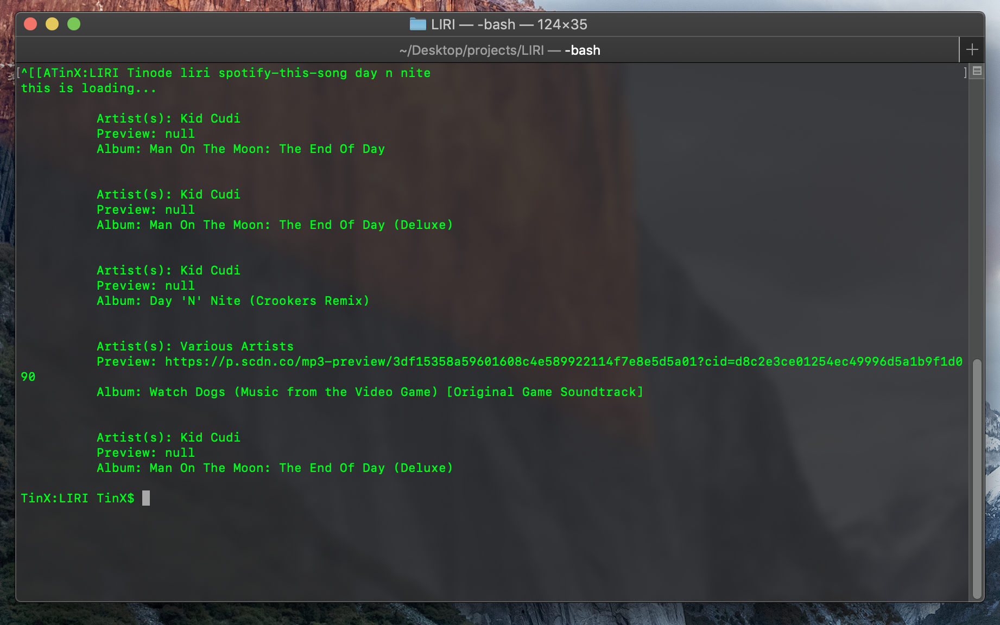
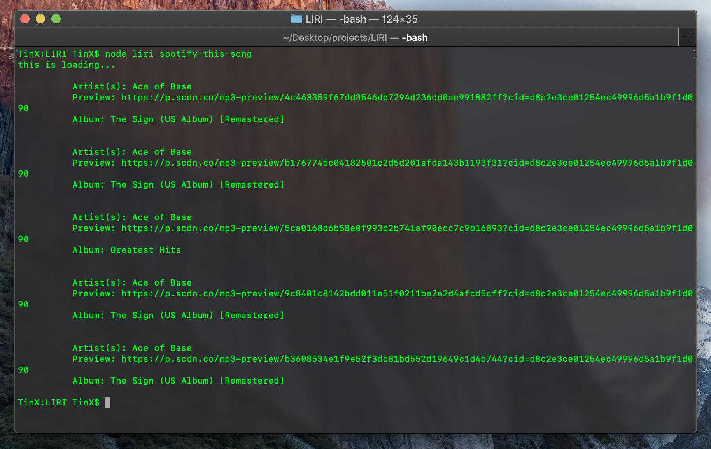
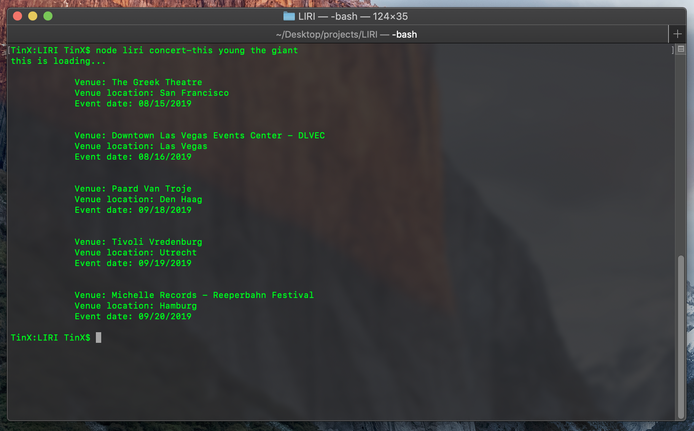
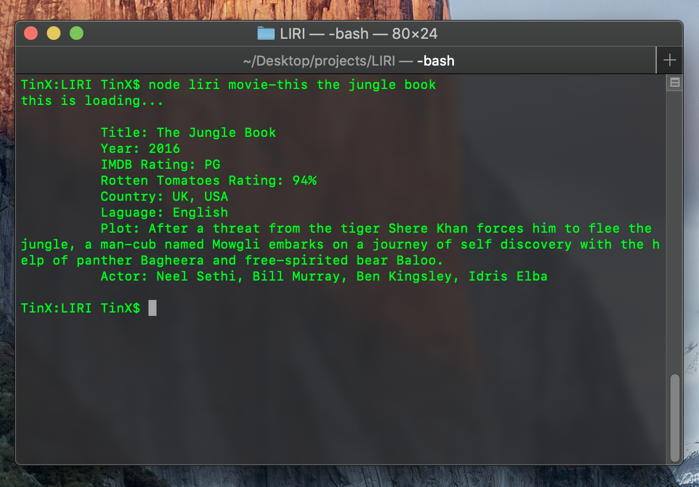
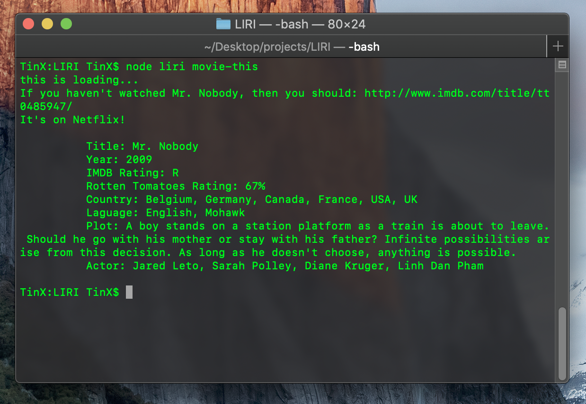
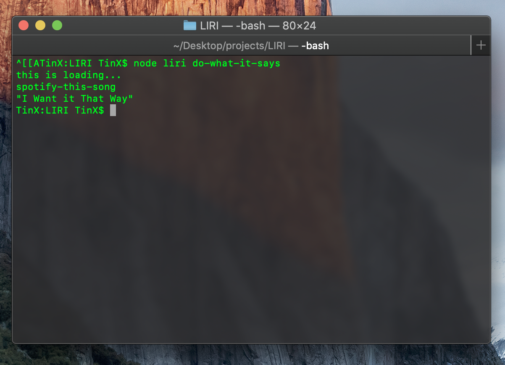

# Liri Node App aka Liri Bot

## Overview
SIRI is a Speech Interpretation and Recognition Interface, LIRI is a Language Interpretation and Recognition Interface. LIRI will be a command line Node app that takes in parameters and gives you back data in the terminal. Liri will search through API databases from spotify, omdb, and bandsintown. 

## Requirements

* Node.js
* Spotify-API-Keys
* Node Package Manager

## Walkthrough

- Clone repo

- From the command line, navigation into the liri pathway

- Select from three main options: concert-this, movie-this, spotify-this-song; 

- The format to search is 'node liri [options] [query]' ex. node liri spotify-this-song day n nite

- To search for an artist or album, type in a song track and use the spotify-this-song command

If spotify query is left blink, Ace of Base - The Sign, will be set to the default search

- To search for dates and venues for upcoming concerts from an artist; use the 'concert-this' command  

- To search for information on a movie, type in the movie title; use the 'movie-this' command

- There is one last hidden command - 'do-what-it-says' 

